# 东方妖妖梦 ～ Perfect Cherry Blossom  
## 产品需求文档（BDD / Gherkin）

---

## 1. 项目概述与背景  
东方妖妖梦（Touhou Youyoumu）是东方Project官方弹幕射击系列第 7 作。玩家操纵三名主角（博丽灵梦、雾雨魔理沙、十六夜咲夜）之一，在六大主关卡及 Extra/Phantasm 关卡中，利用樱点系统提升战力、击败各关 BOSS，并最终解决「春雪异变」。

## 2. Feature 概览 

### 2.1 功能场景摘要

| Feature | Rule | Scenario/Scenario Outline | 类型 | 测试用例数 |
|---------|------|---------------------------|------|------------|
| **Character Selection<br/>角色选择** | 角色与机体映射 | 成功选择角色与机体 | Scenario Outline | 6 |
| | 返回标题 | 放弃选择返回标题 | Scenario | 1 |
| **Difficulty Selection<br/>难度选择** | 难度选择流程 | 成功进入难度选择界面 | Scenario | 1 |
| | 难度解锁条件 | 选择未解锁的Lunatic难度 | Scenario | 1 |
| | | 成功解锁Lunatic并选择 | Scenario | 1 |
| | 难度参数影响 | 应用难度系数 | Scenario Outline | 4 |
| **Stage Progression<br/>关卡流程** | 关卡加载 | 关卡启动 | Scenario Outline | 4 |
| | 地图滚动机制 | 地图背景滚动 | Scenario Outline | 3 |
| | 玩家移动边界 | 玩家边界检测 | Scenario | 1 |
| | | 边界碰撞处理 | Scenario Outline | 4 |
| | 地图环境效果 | 环境效果激活 | Scenario Outline | 4 |
| | 特殊区域交互 | 特殊区域触发 | Scenario Outline | 4 |
| | 地图装饰物交互 | 装饰物层次渲染 | Scenario | 1 |
| | | 装饰物动画效果 | Scenario | 1 |
| | 普通敌机生成规则 | 普通敌机出现 | Scenario Outline | 3 |
| | BOSS战触发规则 | BOSS战开始 | Scenario Outline | 4 |
| | BOSS阶段进程 | BOSS攻击阶段转换 | Scenario | 1 |
| | | 符卡阶段结束转换 | Scenario | 1 |
| | 关卡结算 | 关卡完结与评分结算 | Scenario | 1 |
| | 特殊关卡解锁 | Extra关卡解锁 | Scenario | 1 |
| | | Phantasm关卡解锁 | Scenario | 1 |
| **Danmaku Shooting<br/>弹幕射击** | 移动模式切换 | 模式切换与射击 | Scenario Outline | 2 |
| | 擦弹得分规则 | 擦弹得分 | Scenario | 1 |
| | 敌机碰撞判定 | 碰撞判定检测 | Scenario Outline | 3 |
| | | 弹幕碰撞判定 | Scenario | 1 |
| | 游戏结束判定 | 残机耗尽游戏结束 | Scenario | 1 |
| | | 主动退出游戏 | Scenario | 1 |
| | | 通关游戏结束 | Scenario | 1 |
| | 敌机击毁判定 | 敌机生命值系统 | Scenario Outline | 4 |
| | | 敌机击毁奖励 | Scenario | 1 |
| | | BOSS击毁特殊处理 | Scenario | 1 |
| **Boss Encounter & Spell Card<br/>BOSS战与符卡** | 符卡宣言规则 | 符卡宣言与计时 | Scenario Outline | 2 |
| | 符卡奖励规则 | 完美符卡击破 | Scenario | 1 |
| | 符卡失败规则 | 失败符卡 | Scenario | 1 |
| **Cherry Point System<br/>樱点系统** | 樱点收集规则 | 收集樱点并触发春度状态 | Scenario Outline | 3 |
| | 春度状态触发规则 | 达到奖励残机阈值 | Scenario | 1 |
| **Story Dialogue<br/>故事系统** | 关卡对话呈现 | 关卡开场对话 | Scenario Outline | 2 |
| | Extra解锁条件 | Extra关开启条件 | Scenario | 1 |

### 2.2 功能场景地图

```mermaid
flowchart LR
    Root[东方妖妖梦] --> A1[Character Selection<br/>角色选择]
    Root --> B1[Difficulty Selection<br/>难度选择]
    Root --> C1[Stage Progression<br/>关卡流程]
    Root --> D1[Danmaku Shooting<br/>弹幕射击]
    Root --> E1[Boss Encounter & Spell Card<br/>BOSS战与符卡]
    Root --> F1[Cherry Point System<br/>樱点系统]
    Root --> G1[Story Dialogue<br/>故事系统]
    
    A1 --> A1R1[角色与机体映射]
    A1 --> A1R2[返回标题]
    A1R1 --> A1R1S1[成功选择角色与机体<br/>Scenario Outline]
    A1R2 --> A1R2S1[放弃选择返回标题<br/>Scenario]
    
    B1 --> B1R1[难度选择流程]
    B1 --> B1R2[难度解锁条件]
    B1 --> B1R3[难度参数影响]
    B1R1 --> B1R1S1[成功进入难度选择界面<br/>Scenario]
    B1R2 --> B1R2S1[选择未解锁的Lunatic难度<br/>Scenario]
    B1R2 --> B1R2S2[成功解锁Lunatic并选择<br/>Scenario]
    B1R3 --> B1R3S1[应用难度系数<br/>Scenario Outline]
    
    C1 --> C1R1[关卡加载]
    C1 --> C1R2[地图滚动机制]
    C1 --> C1R3[玩家移动边界]
    C1 --> C1R4[地图环境效果]
    C1 --> C1R5[特殊区域交互]
    C1 --> C1R6[地图装饰物交互]
    C1 --> C1R7[普通敌机生成规则]
    C1 --> C1R8[BOSS战触发规则]
    C1 --> C1R9[BOSS阶段进程]
    C1 --> C1R10[关卡结算]
    C1 --> C1R11[特殊关卡解锁]
    C1R1 --> C1R1S1[关卡启动<br/>Scenario Outline]
    C1R2 --> C1R2S1[地图背景滚动<br/>Scenario Outline]
    C1R3 --> C1R3S1[玩家边界检测<br/>Scenario]
    C1R3 --> C1R3S2[边界碰撞处理<br/>Scenario Outline]
    C1R4 --> C1R4S1[环境效果激活<br/>Scenario Outline]
    C1R5 --> C1R5S1[特殊区域触发<br/>Scenario Outline]
    C1R6 --> C1R6S1[装饰物层次渲染<br/>Scenario]
    C1R6 --> C1R6S2[装饰物动画效果<br/>Scenario]
    C1R7 --> C1R7S1[普通敌机出现<br/>Scenario Outline]
    C1R8 --> C1R8S1[BOSS战开始<br/>Scenario Outline]
    C1R9 --> C1R9S1[BOSS攻击阶段转换<br/>Scenario]
    C1R9 --> C1R9S2[符卡阶段结束转换<br/>Scenario]
    C1R10 --> C1R10S1[关卡完结与评分结算<br/>Scenario]
    C1R11 --> C1R11S1[Extra关卡解锁<br/>Scenario]
    C1R11 --> C1R11S2[Phantasm关卡解锁<br/>Scenario]
    
    D1 --> D1R1[移动模式切换]
    D1 --> D1R2[擦弹得分规则]
    D1 --> D1R3[敌机碰撞判定]
    D1 --> D1R4[游戏结束判定]
    D1 --> D1R5[敌机击毁判定]
    D1R1 --> D1R1S1[模式切换与射击<br/>Scenario Outline]
    D1R2 --> D1R2S1[擦弹得分<br/>Scenario]
    D1R3 --> D1R3S1[碰撞判定检测<br/>Scenario Outline]
    D1R3 --> D1R3S2[弹幕碰撞判定<br/>Scenario]
    D1R4 --> D1R4S1[残机耗尽游戏结束<br/>Scenario]
    D1R4 --> D1R4S2[主动退出游戏<br/>Scenario]
    D1R4 --> D1R4S3[通关游戏结束<br/>Scenario]
    D1R5 --> D1R5S1[敌机生命值系统<br/>Scenario Outline]
    D1R5 --> D1R5S2[敌机击毁奖励<br/>Scenario]
    D1R5 --> D1R5S3[BOSS击毁特殊处理<br/>Scenario]
    
    E1 --> E1R1[符卡宣言规则]
    E1 --> E1R2[符卡奖励规则]
    E1 --> E1R3[符卡失败规则]
    E1R1 --> E1R1S1[符卡宣言与计时<br/>Scenario Outline]
    E1R2 --> E1R2S1[完美符卡击破<br/>Scenario]
    E1R3 --> E1R3S1[失败符卡<br/>Scenario]
    
    F1 --> F1R1[樱点收集规则]
    F1 --> F1R2[春度状态触发规则]
    F1R1 --> F1R1S1[收集樱点并触发春度状态<br/>Scenario Outline]
    F1R2 --> F1R2S1[达到奖励残机阈值<br/>Scenario]
    
    G1 --> G1R1[关卡对话呈现]
    G1 --> G1R2[Extra解锁条件]
    G1R1 --> G1R1S1[关卡开场对话<br/>Scenario Outline]
    G1R2 --> G1R2S1[Extra关开启条件<br/>Scenario]
    
    %% 样式定义
    classDef rootStyle fill:#ff9999,stroke:#333,stroke-width:3px
    classDef featureStyle fill:#66b3ff,stroke:#333,stroke-width:2px
    classDef ruleStyle fill:#99ff99,stroke:#333,stroke-width:2px
    classDef scenarioStyle fill:#ffcc99,stroke:#333,stroke-width:1px
    
    class Root rootStyle
    class A1,B1,C1,D1,E1,F1,G1 featureStyle
    class A1R1,A1R2,B1R1,B1R2,B1R3,C1R1,C1R2,C1R3,C1R4,C1R5,C1R6,C1R7,C1R8,C1R9,C1R10,C1R11,D1R1,D1R2,D1R3,D1R4,D1R5,E1R1,E1R2,E1R3,F1R1,F1R2,G1R1,G1R2 ruleStyle
    class A1R1S1,A1R2S1,B1R1S1,B1R2S1,B1R2S2,B1R3S1,C1R1S1,C1R2S1,C1R3S1,C1R3S2,C1R4S1,C1R5S1,C1R6S1,C1R6S2,C1R7S1,C1R8S1,C1R9S1,C1R9S2,C1R10S1,C1R11S1,C1R11S2,D1R1S1,D1R2S1,D1R3S1,D1R3S2,D1R4S1,D1R4S2,D1R4S3,D1R5S1,D1R5S2,D1R5S3,E1R1S1,E1R2S1,E1R3S1,F1R1S1,F1R2S1,G1R1S1,G1R2S1 scenarioStyle
```



## 3. 详细 Gherkin 用例  

### 3.1 Feature: Character Selection / 角色选择
```gherkin
Feature: 角色选择
  为玩家提供三名角色与六种机体的选择，影响射击方式及游戏难度平衡。

  Background:
    Given 系统已定义「角色机体映射表」:
      | 角色       | 机体类型      | 射击特性 | 速率 | 威力 |
      | 博丽灵梦   | 灵梦A-追踪符  | 追踪     | 中速 | 中   |
      | 博丽灵梦   | 灵梦B-扩散符  | 扩散     | 低速 | 中   |
      | 雾雨魔理沙 | 魔理沙A-集中符 | 激光集中 | 高速 | 高   |
      | 雾雨魔理沙 | 魔理沙B-高速符 | 高速散射 | 最高 | 低   |
      | 十六夜咲夜 | 咲夜A-范围符  | 刀片散射 | 中速 | 中   |
      | 十六夜咲夜 | 咲夜B-锁定符  | 追踪锁定 | 低速 | 高   |

  Rule: 角色与机体映射 — 每个角色拥有两种专属机体
    Scenario Outline: 成功选择角色与机体
      When 玩家选择 <角色> 并选择 <机体>
      Then 游戏应切换至难度选择界面
      And 已记录玩家选择信息

      Examples:
        | 角色       | 机体         |
        | 博丽灵梦   | 灵梦A-追踪符  |
        | 博丽灵梦   | 灵梦B-扩散符  |
        | 雾雨魔理沙 | 魔理沙A-集中符|
        | 雾雨魔理沙 | 魔理沙B-高速符|
        | 十六夜咲夜 | 咲夜A-范围符  |
        | 十六夜咲夜 | 咲夜B-锁定符  |

  Rule: 返回标题 — 允许玩家取消选择返回主菜单
    Scenario: 放弃选择返回标题
      When 玩家在角色选择界面按下"返回"
      Then 系统返回标题界面
```

### 3.2 Feature: Difficulty Selection / 难度选择
```gherkin
Feature: 难度选择
  玩家在选择角色后进入难度选择界面，选择或解锁不同难度并应用相应游戏参数系数。

  Background:
    Given 系统已定义「难度配置表」:
      | 难度名称  | 解锁条件                        | 弹速系数 | 弹幕密度系数 | 符卡时长系数 | 是否默认解锁 |
      | Easy      | 无                              | 0.7      | 0.7          | 1.2          | 是           |
      | Normal    | 无                              | 1.0      | 1.0          | 1.0          | 是           |
      | Hard      | 完成 Normal 难度通关           | 1.3      | 1.3          | 0.9          | 否           |
      | Lunatic   | 完成 Hard 难度通关（无 Continue）| 1.6      | 1.6          | 0.8          | 否           |

  Rule: 难度选择流程 — 从角色选择后进入难度选择
    Scenario: 成功进入难度选择界面
      Given 玩家已完成角色与机体选择
      When 系统加载难度选择界面
      Then 显示「难度配置表」中已解锁难度
      And 光标默认选中 Normal 难度

  Rule: 难度解锁条件 — 高级难度需要满足解锁条件
    Scenario: 选择未解锁的 Lunatic 难度
      Given 玩家尚未通关 Hard 难度
      When 玩家尝试选择 Lunatic 难度
      Then 系统提示 "难度未解锁"
      And 保持难度选择界面

    Scenario: 成功解锁 Lunatic 并选择
      Given 玩家已无 Continue 通关 Hard 难度
      When 玩家选择 Lunatic 难度
      Then 系统确认难度选择为 Lunatic
      And 进入游戏加载画面

  Rule: 难度参数影响 — 不同难度对游戏的影响
    Scenario Outline: 应用难度系数
      Given 当前难度为 <难度名称>
      When 游戏逻辑初始化
      Then 弹速全局系数应为 <弹速系数>
      And 弹幕密度全局系数应为 <密度系数>
      And 符卡时长系数应为 <时长系数>

      Examples:
        | 难度名称 | 弹速系数 | 密度系数 | 时长系数 |
        | Easy     | 0.7      | 0.7      | 1.2      |
        | Normal   | 1.0      | 1.0      | 1.0      |
        | Hard     | 1.3      | 1.3      | 0.9      |
        | Lunatic  | 1.6      | 1.6      | 0.8      |
```

### 3.3 Feature: Stage Progression / 关卡流程
```gherkin
Feature: 关卡流程
  管理六个主关卡及 Extra/Phantasm 的启动、结束与难度流程。

  Background:
    Given 系统已定义「关卡配置表」:
      | 关卡类型 | 关卡号 | 关卡名称           | 背景音乐ID     | BOSS名称               |
      | 主关卡   | 1      | 雪与樱的故乡       | BGM_S1         | 琪露诺                 |
      | 主关卡   | 2      | 无人的厅堂         | BGM_S2         | 蕾迪·霍瓦特洛克       |
      | 主关卡   | 3      | 白玉楼的阶梯       | BGM_S3         | 爱丽丝·玛格特洛依德   |
      | 主关卡   | 4      | 樱花的幻想         | BGM_S4         | 普莉兹姆利巴三姐妹   |
      | 主关卡   | 5      | 墨染的樱花         | BGM_S5         | 魂魄妖梦               |
      | 主关卡   | 6      | 冥界之旅           | BGM_S6         | 西行寺幽幽子           |
      | Extra    | EX     | 紫色的海           | BGM_EX         | 八云蓝                 |
      | Phantasm | PH     | 境界之間           | BGM_PH         | 八云紫                 |
    And 系统已定义「地图背景配置表」:
      | 关卡号 | 主背景           | 前景元素         | 滚动速度 | 环境效果     | 特殊装饰             |
      | 1      | 雪景樱花林       | 飘落雪花         | 2px/帧   | 雪花飘散     | 粉色樱花瓣           |
      | 2      | 白玉楼外廊       | 石柱回廊         | 3px/帧   | 寒气缭绕     | 冰晶装饰             |
      | 3      | 石阶小径         | 白玉石阶         | 2.5px/帧 | 雾气弥漫     | 古典灯笼             |
      | 4      | 樱花幻境         | 樱花树丛         | 4px/帧   | 花瓣旋舞     | 幻象光影             |
      | 5      | 半开樱园         | 墨色樱树         | 3px/帧   | 阴阳交替     | 半透明樱花           |
      | 6      | 冥界庭园         | 彼岸花田         | 2px/帧   | 灵魂飘浮     | 死蝶群舞             |
      | EX     | 蓝色异空间       | 几何图案         | 5px/帧   | 空间扭曲     | 式神符文             |
      | PH     | 境界缝隙         | 裂隙边界         | 6px/帧   | 现实撕裂     | 紫色光带             |
    And 系统已定义「地图边界配置表」:
      | 关卡号 | 游戏区域宽度 | 游戏区域高度 | 玩家移动边界左 | 玩家移动边界右 | 玩家移动边界上 | 玩家移动边界下 |
      | ALL    | 640px        | 480px        | 32px           | 608px          | 16px           | 464px          |
    And 系统已定义「普通敌机配置表」:
      | 关卡号 | 敌机类型     | 出现时机   | HP  | 移动模式   | 弹幕类型     |
      | 1      | 雪妖精       | 开场       | 15  | 直线       | 单发弹       |
      | 1      | 冰妖精       | 中期       | 25  | 波浪       | 散射弹       |
      | 2      | 寒气妖精     | 开场       | 20  | 螺旋       | 冰晶弹       |
      | 2      | 雪女仆       | 中期       | 35  | 追踪       | 扇形弹       |
      | 3      | 人偶兵       | 开场       | 30  | 编队       | 直线弹       |
      | 3      | 魔法人偶     | 中期       | 45  | 瞬移       | 魔力弹       |
      | 4      | 春妖精       | 开场       | 25  | 飞舞       | 花瓣弹       |
      | 4      | 骚灵        | 中期       | 40  | 漂浮       | 音符弹       |
      | 5      | 幽灵        | 开场       | 35  | 穿墙       | 灵力弹       |
      | 5      | 半灵        | 中期       | 50  | 分身       | 剑气弹       |
      | 6      | 死灵        | 开场       | 45  | 群聚       | 蝶弹         |
      | 6      | 亡灵蝶      | 后期       | 60  | 环绕       | 死亡弹       |
    And 系统已定义「BOSS配置表」:
      | BOSS名称             | 关卡号 | 通常攻击阶段数 | 符卡数量 | 总HP    |
      | 琪露诺               | 1      | 2              | 2        | 1500    |
      | 蕾迪·霍瓦特洛克     | 2      | 3              | 3        | 2200    |
      | 爱丽丝·玛格特洛依德 | 3      | 3              | 4        | 2800    |
      | 普莉兹姆利巴三姐妹 | 4      | 4              | 5        | 3500    |
      | 魂魄妖梦             | 5      | 4              | 6        | 4200    |
      | 西行寺幽幽子         | 6      | 5              | 7        | 5000    |
      | 八云蓝               | EX     | 6              | 8        | 6000    |
      | 八云紫               | PH     | 7              | 9        | 8000    |
    And 系统已定义「地图特殊区域配置表」:
      | 关卡号 | 特殊区域类型   | 位置坐标       | 触发效果         | 持续时间 |
      | 1      | 樱花飞舞区域   | (200,100,100,80) | 樱点自动收集     | 5秒      |
      | 3      | 雾气迷障       | (150,200,200,60) | 视野模糊         | 8秒      |
      | 4      | 幻象回廊       | (100,150,150,100)| 敌机幻影分身     | 6秒      |
      | 6      | 死境漩涡       | (300,250,80,80)  | 弹幕速度减半     | 4秒      |

  Rule: 关卡加载 — 根据难度和编号初始化资源
    Scenario Outline: 关卡启动
      Given 玩家在难度 <难度> 下开始游戏
      When 关卡编号为 <关卡号> 加载完成
      Then 播放对应的关卡背景音乐
      And 显示关卡标题与BOSS剪影
      And 加载该关卡的普通敌机配置
      And 初始化地图背景与环境效果

      Examples:
        | 难度    | 关卡号 |
        | Easy    | 1      |
        | Normal  | 3      |
        | Hard    | 6      |
        | Lunatic | EX     |

  Rule: 地图滚动机制 — 背景按配置速度向下滚动
    Scenario Outline: 地图背景滚动
      Given 关卡 <关卡号> 已开始
      When 游戏帧更新
      Then 主背景以 <滚动速度> 向下滚动
      And 前景元素同步滚动
      And 环境效果 <环境效果> 持续播放

      Examples:
        | 关卡号 | 滚动速度 | 环境效果 |
        | 1      | 2px/帧   | 雪花飘散 |
        | 4      | 4px/帧   | 花瓣旋舞 |
        | EX     | 5px/帧   | 空间扭曲 |

  Rule: 玩家移动边界 — 限制玩家在有效游戏区域内移动
    Scenario: 玩家边界检测
      Given 玩家当前位置为 (x, y)
      When 玩家尝试移动到新位置
      Then 检查新位置是否在移动边界内
      And 如果超出边界则限制在边界位置
      And 保持玩家在 (32px, 608px, 16px, 464px) 矩形内

    Scenario Outline: 边界碰撞处理
      Given 玩家位于 <当前位置>
      When 玩家向 <移动方向> 移动
      Then 玩家最终位置为 <最终位置>

      Examples:
        | 当前位置  | 移动方向 | 最终位置  |
        | (30, 100) | 左       | (32, 100) |
        | (610, 200)| 右       | (608, 200)|
        | (100, 10) | 上       | (100, 16) |
        | (100, 470)| 下       | (100, 464)|

  Rule: 地图环境效果 — 不同关卡的视觉与音效环境
    Scenario Outline: 环境效果激活
      Given 进入关卡 <关卡号>
      When 地图加载完成
      Then 激活 <环境效果>
      And 在前景显示 <特殊装饰>
      And 粒子效果按地图主题播放

      Examples:
        | 关卡号 | 环境效果 | 特殊装饰     |
        | 1      | 雪花飘散 | 粉色樱花瓣   |
        | 2      | 寒气缭绕 | 冰晶装饰     |
        | 6      | 灵魂飘浮 | 死蝶群舞     |
        | PH     | 现实撕裂 | 紫色光带     |

  Rule: 特殊区域交互 — 地图中的特殊区域提供临时效果
    Scenario Outline: 特殊区域触发
      Given 关卡 <关卡号> 存在特殊区域 <区域类型>
      When 玩家进入区域坐标范围
      Then 触发 <触发效果>
      And 效果持续 <持续时间>
      And 播放对应的视觉提示

      Examples:
        | 关卡号 | 区域类型     | 触发效果       | 持续时间 |
        | 1      | 樱花飞舞区域 | 樱点自动收集   | 5秒      |
        | 3      | 雾气迷障     | 视野模糊       | 8秒      |
        | 4      | 幻象回廊     | 敌机幻影分身   | 6秒      |
        | 6      | 死境漩涡     | 弹幕速度减半   | 4秒      |

  Rule: 地图装饰物交互 — 非碰撞装饰元素的视觉层次
    Scenario: 装饰物层次渲染
      Given 地图包含装饰元素
      When 渲染游戏画面
      Then 背景层在最底层
      And 装饰物在背景层之上
      And 游戏实体在装饰物之上
      And UI元素在最顶层

    Scenario: 装饰物动画效果
      Given 地图装饰物支持动画
      When 游戏运行中
      Then 樱花瓣按风向飘落
      And 灯笼发出温暖光晕
      And 死蝶群作螺旋飞舞
      And 所有动画不影响游戏逻辑判定

  Rule: 普通敌机生成规则 — 按时机和配置生成敌机
    Scenario Outline: 普通敌机出现
      Given 关卡 <关卡号> 已开始
      When 到达 <出现时机> 阶段
      Then 生成 <敌机类型> 敌机
      And 敌机HP设置为 <HP>
      And 敌机采用 <移动模式> 移动方式
      And 敌机发射 <弹幕类型>

      Examples:
        | 关卡号 | 出现时机 | 敌机类型 | HP | 移动模式 | 弹幕类型 |
        | 1      | 开场     | 雪妖精   | 15 | 直线     | 单发弹   |
        | 3      | 中期     | 魔法人偶 | 45 | 瞬移     | 魔力弹   |
        | 5      | 后期     | 半灵     | 50 | 分身     | 剑气弹   |

  Rule: BOSS战触发规则 — 普通敌机清理完毕后进入BOSS战
    Scenario Outline: BOSS战开始
      Given 关卡 <关卡号> 的普通敌机已全部击败
      When BOSS <BOSS名称> 登场
      Then 播放BOSS登场动画
      And 显示BOSS名称与立绘
      And 初始化BOSS HP为 <总HP>
      And 开始第一个通常攻击阶段
      And 地图滚动暂停

      Examples:
        | 关卡号 | BOSS名称             | 总HP |
        | 1      | 琪露诺               | 1500 |
        | 3      | 爱丽丝·玛格特洛依德 | 2800 |
        | 6      | 西行寺幽幽子         | 5000 |
        | EX     | 八云蓝               | 6000 |

  Rule: BOSS阶段进程 — 通常攻击与符卡交替进行
    Scenario: BOSS攻击阶段转换
      Given BOSS当前处于通常攻击阶段
      When BOSS当前阶段HP耗尽
      Then 进入对应的符卡宣言阶段
      And 暂停BOSS移动
      And 清除屏幕上的弹幕
      And 地图背景切换为符卡专用背景

    Scenario: 符卡阶段结束转换
      Given BOSS当前处于符卡阶段
      When 符卡被击破或时间耗尽
      Then 进入下一个通常攻击阶段
      And 恢复BOSS正常移动模式
      And 重置弹幕发射模式
      And 恢复正常地图背景

  Rule: 关卡结算 — BOSS击破后展示评分
    Scenario: 关卡完结与评分结算
      When BOSS总HP归零且所有阶段完成
      Then 播放通关音效
      And 显示评分结算面板
      And 统计击破敌机数、擦弹数、收集樱点数
      And 解锁下一关卡（如有）
      And 停止地图滚动和环境效果

  Rule: 特殊关卡解锁 — Extra和Phantasm的解锁条件
    Scenario: Extra关卡解锁
      Given 玩家在Normal难度以上通关Stage6
      And 未使用Continue
      When 返回标题画面
      Then Extra关卡选项变为可选

    Scenario: Phantasm关卡解锁
      Given 玩家已通关Extra关卡
      And 在Extra关卡中收集所有特殊道具
      When 返回标题画面
      Then Phantasm关卡选项变为可选
```

### 3.4 Feature: Danmaku Shooting / 弹幕射击
```gherkin
Feature: 弹幕射击
  玩家可在高速/低速两种移动模式下射击并擦弹获取分数。

  Background:
    Given 系统已定义「移动模式配置表」:
      | 移动模式 | 操作键 | 期望速度 | 射击形式 |
      | 高速     | Shift  | 低速     | 精准集中 |
      | 低速     | Shift  | 高速     | 散射     |
    And 系统已定义「擦弹判定配置表」:
      | 参数     | 值  |
      | 擦弹距离 | 3px |
      | 擦弹分数 | 500 |
    And 系统已定义「碰撞判定配置表」:
      | 参数           | 值    |
      | 玩家hitbox半径 | 2px   |
      | 敌机hitbox半径 | 8px   |
      | 弹幕hitbox半径 | 4px   |
    And 系统已定义「游戏结束条件配置表」:
      | 条件     | 值  |
      | 初始残机 | 3   |
      | 初始Bomb | 3   |

  Rule: 移动模式切换 — Shift键切换高低速
    Scenario Outline: 模式切换与射击
      Given 玩家处于 <移动模式>
      When 玩家按下 <操作键>
      Then 移动速度应切换为 <期望速度>
      And 射击类型为 <射击形式>

      Examples:
        | 移动模式 | 操作键 | 期望速度 | 射击形式 |
        | 高速     | Shift  | 低速     | 精准集中 |
        | 低速     | Shift  | 高速     | 散射     |

  Rule: 擦弹得分规则 — 距离3px内视为擦弹
    Scenario: 擦弹得分
      Given 子弹与玩家 hitbox 距离小于 3px
      When 没有发生碰撞
      Then 系统记录一次擦弹
      And 给予 500 分基础分数

  Rule: 敌机碰撞判定 — 玩家与敌机或弹幕接触判定
    Scenario Outline: 碰撞判定检测
      Given 玩家位于坐标 (100, 200)
      And 敌机位于坐标 <敌机坐标>
      When 计算两者中心距离
      Then 判定结果为 <是否碰撞>

      Examples:
        | 敌机坐标    | 是否碰撞 |
        | (100, 210) | 是       |
        | (105, 205) | 是       |
        | (112, 212) | 否       |

    Scenario: 弹幕碰撞判定
      Given 玩家 hitbox 半径为 2px
      And 弹幕 hitbox 半径为 4px
      When 玩家中心与弹幕中心距离 ≤ 6px
      Then 判定为碰撞
      And 触发玩家Miss状态

  Rule: 游戏结束判定 — 残机耗尽或主动退出
    Scenario: 残机耗尽游戏结束
      Given 当前残机数为 0
      When 玩家发生碰撞触发Miss
      Then 播放游戏结束音效
      And 显示 "Game Over" 画面
      And 记录最终得分到排行榜

    Scenario: 主动退出游戏
      Given 游戏进行中
      When 玩家按下ESC键选择退出
      Then 暂停游戏显示退出确认对话框
      And 选择确认后返回标题画面

    Scenario: 通关游戏结束
      Given 玩家完成最后一个关卡
      When BOSS被击败且关卡结算完成
      Then 播放通关音效
      And 显示Ending画面
      And 解锁相应难度成就

  Rule: 敌机击毁判定 — 累计伤害达到HP上限
    Scenario Outline: 敌机生命值系统
      Given 敌机类型为 <敌机类型> HP为 <初始HP>
      When 玩家射击命中造成 <伤害值> 点伤害
      Then 敌机剩余HP为 <剩余HP>
      And 击毁状态为 <是否击毁>

      Examples:
        | 敌机类型 | 初始HP | 伤害值 | 剩余HP | 是否击毁 |
        | 小妖精   | 10     | 5      | 5      | 否       |
        | 小妖精   | 10     | 10     | 0      | 是       |
        | 中妖精   | 50     | 30     | 20     | 否       |
        | 大妖精   | 100    | 100    | 0      | 是       |

    Scenario: 敌机击毁奖励
      Given 敌机被击毁
      When 击毁动画播放完成
      Then 在敌机位置生成得分道具
      And 播放击毁音效
      And 根据敌机类型给予对应分数

    Scenario: BOSS击毁特殊处理
      Given BOSS类型敌机HP归零
      When 非符卡阶段被击毁
      Then 进入下一个攻击阶段或符卡
      
      But 符卡阶段被击毁
      Then 符卡宣告结束
      And 判定符卡完成奖励
```

### 3.5 Feature: Boss Encounter & Spell Card / BOSS 战与符卡
```gherkin
Feature: BOSS 战与符卡
  每位BOSS拥有多张符卡，击破符卡可获得奖励，失败则损失奖励。

  Background:
    Given 系统已定义「符卡配置表」:
      | 符卡名                 | 时长(s) | 奖励分 |
      | 「冰符　冰袭方阵」     | 30      | 200000 |
      | 「亡灵　华胥的亡灵蝶」 | 45      | 200000 |

  Rule: 符卡宣言规则 — BOSS宣言后计时开始
    Scenario Outline: 符卡宣言与计时
      Given 进入 BOSS Phase
      When BOSS 宣言符卡 <符卡名> 限时 <时长> 秒
      Then 屏幕中央显示符卡标题
      And 计时器开始倒计 <时长> 秒

      Examples:
        | 符卡名                 | 时长 |
        | 「冰符　冰袭方阵」     | 30  |
        | 「亡灵　华胥的亡灵蝶」 | 45  |

  Rule: 符卡奖励规则 — 无Miss无Bomb击破奖励
    Scenario: 完美符卡击破
      Given BOSS 当前符卡剩余时间 > 0
      When 玩家在无Miss无Bomb情况下击破符卡
      Then 获得 "符卡奖励" 标识
      And 追加 200000 分

  Rule: 符卡失败规则 — Miss或Bomb取消奖励
    Scenario: 失败符卡
      When 玩家在符卡期间 Miss 或 Bomb
      Then 取消该符卡奖励
```

### 3.6 Feature: Cherry Point System / 樱点系统
```gherkin
Feature: 樱点系统
  玩家通过收集樱点提升樱计量，达到阈值启动春度状态并可获残机。

  Background:
    Given 系统已定义「樱点系统配置表」:
      | 配置ID | 樱计量上限 | 春度持续时间(s) | 春度触发阈值 | 残机奖励首次阈值 | 残机奖励后续间隔 |
      | DEFAULT| 50000      | 10              | 50000        | 3                | 5                |

  Rule: 樱点收集规则 — 每拾取1樱点增加1计量
    Scenario Outline: 收集樱点并触发春度状态
      Given 当前樱计量为 <初始值>
      When 玩家收集了 <收集数量> 个樱点
      Then 樱计量应为 <结果樱计量>
      And 是否触发春度状态 = <是否触发春度>

      Examples:
        | 初始值 | 收集数量 | 是否触发春度 | 结果樱计量 |
        | 49500 | 600   | 是 | 100  |
        | 40000 | 12000 | 是 | 2000 |
        | 0     | 51000 | 是 | 1000 |

  Rule: 春度状态触发规则 — 累计次数奖励残机
    Scenario: 达到奖励残机阈值
      Given 已累计获得 3 次春度状态
      When 再次进入春度状态
      Then 玩家增加 1 残机
```

### 3.7 Feature: Story Dialogue / 故事系统
```gherkin
Feature: 故事系统
  对话呈现角色立绘与文本，决定剧情走向与结局解锁逻辑。

  Background:
    Given 系统已定义「对话映射表」:
      | 关卡   | 自机       | 对手       | 对话脚本ID |
      | Stage 1| 博丽灵梦   | 琪露诺     | DLG_S1_RM  |
      | Stage 1| 雾雨魔理沙 | 琪露诺     | DLG_S1_MS  |
      | Stage 1| 十六夜咲夜 | 琪露诺     | DLG_S1_SA  |
      | Stage 5| 雾雨魔理沙 | 魂魄妖梦   | DLG_S5_MS  |

  Rule: 关卡对话呈现 — 开场/中场/结尾对话
    Scenario Outline: 关卡开场对话
      Given 进入 <关卡> 前
      When 系统加载对话脚本
      Then 显示 <自机> 与 <对手> 的立绘
      And 播放对应文本框动画

      Examples:
        | 关卡   | 自机       | 对手       |
        | Stage 1| 博丽灵梦   | 琪露诺     |
        | Stage 5| 雾雨魔理沙 | 魂魄妖梦   |

  Rule: Extra解锁条件 — 正常通关后开放Extra
    Scenario: Extra 关开启条件
      Given 玩家以任意角色在 Normal 难度通关
      And 无 Continue
      When 查看标题菜单
      Then Extra 关卡选项应可选中
```

---

## 4. 用户体验与边界条件
1. **输入延迟容忍度**：操作至渲染延迟 ≤ 100 ms，保证高难度弹幕精确避弹。  
2. **分辨率支持**：最小 640 × 480，窗口/全屏可切换，UI 等比例缩放。  
3. **存档与回放**：每次通关或失败自动生成 replay 文件；异常关闭时写入临时存档保证数据完整。  
4. **性能边界**：同屏最大弹幕数量 ≥ 1500；FPS 目标值 60，低于 55 持续 3 秒触发性能警告。  
5. **键位冲突**：检测多键输入冲突并提供自定义键位方案。  

---

## 5. 附录  
- **难度矩阵**：Easy/Normal/Hard/Lunatic 在弹速、密度、符卡时长等维度按 0.7/1/1.3/1.6 系数缩放。  
- **残机奖励表**：首次春度状态 1UP 累计达 3 次；以后每 5 次额外 1UP。  
- **测试环境**：Windows 10/11，DirectX 9.0c 以上；兼容 Wine。  

---

> 本文档遵循 BDD 最佳实践，所有 Feature、Rule 与 Scenario 既可作为开发需求，也可直接驱动自动化测试。  
